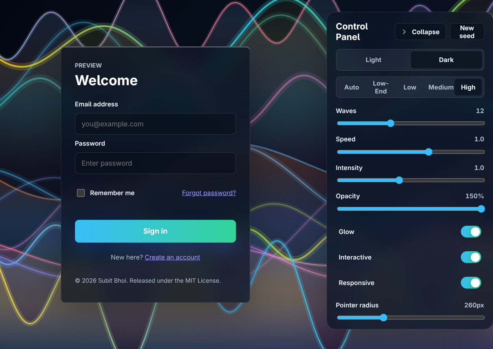

<div align="center">


# 🌊 Wave Background

### Beautiful animated wave backgrounds for React

Lightweight • Responsive • Theme-Aware • High Performance

<p>
  
  
  
  
</p>

<p>
A production-ready React canvas background featuring fluid animated waves,
automatic theme adaptation, intelligent performance scaling,
and optional pointer interaction.
</p>

</div>

---

## ✨ Preview

<p align="center">
  
</p>

---

## ✨ Features

| Feature              | Description                                        |
| -------------------- | -------------------------------------------------- |
| 🌊 Fluid Animation   | High-performance procedural wave generation        |
| 🖱️ Interactive       | Responds to mouse and touch movement               |
| 🌓 Theme Aware       | Supports light, dark, and automatic modes          |
| 📱 Responsive        | Adapts seamlessly to all screen sizes              |
| ⚡ Optimized         | Quality scaling based on device capabilities       |
| 🎨 Customizable      | Configure colors, speed, intensity, glow, and more |
| ♿ Accessible        | Respects `prefers-reduced-motion`                  |
| 📦 Zero Dependencies | Built using the Canvas 2D API                      |

---

## 📦 Installation

Install via your preferred package manager:

```bash
npm install @subitbhoi/wave-background
```

```bash
pnpm add @subitbhoi/wave-background
```

```bash
yarn add @subitbhoi/wave-background
```

---

## 🚀 Quick Start

Import both the component and stylesheet.

```tsx
import { WaveBackground } from "@subitbhoi/wave-background";
import "@subitbhoi/wave-background/style.css"; // ⚠️ Required for layout and positioning

export default function App() {
  return (
    <main>
      <WaveBackground colorMode="auto" waveCount={12} speed={1} />

      <div className="content">
        <h1>Your Foreground Content</h1>
      </div>
    </main>
  );
}
```

---

## 🎨 Contained Sections

Render the animation inside a specific section instead of the entire viewport.

```tsx
<section
  style={{
    position: "relative",
    overflow: "hidden",
    height: "500px",
  }}
>
  <WaveBackground position="absolute" />

  <div
    style={{
      position: "relative",
      zIndex: 1,
    }}
  >
    Content goes here
  </div>
</section>
```

---

## 🎛️ Customization Example

```tsx
<WaveBackground
  waveCount={16}
  speed={1.4}
  intensity={1.2}
  opacity={0.9}
  glow
  interactive
  colorMode="auto"
/>
```

---

## 📖 API Reference

| Prop          | Type                            | Default         | Description                   |
| ------------- | ------------------------------- | --------------- | ----------------------------- |
| `position`    | `"fixed" \| "absolute"`         | `"fixed"`       | Rendering position            |
| `waveCount`   | `number`                        | `12`            | Number of rendered waves      |
| `speed`       | `number`                        | `1`             | Animation speed               |
| `intensity`   | `number`                        | `1`             | Wave amplitude multiplier     |
| `opacity`     | `number`                        | `1`             | Global opacity multiplier     |
| `glow`        | `boolean`                       | `true`          | Soft glow effect              |
| `interactive` | `boolean`                       | `true`          | Mouse and touch interaction   |
| `quality`     | `"auto" \| "high" \| "low-end"` | `"auto"`        | Performance profile           |
| `colorMode`   | `"auto" \| "light" \| "dark"`   | `"auto"`        | Theme selection               |
| `colors`      | `string[]`                      | Default palette | Light mode colors             |
| `darkColors`  | `string[]`                      | Default palette | Dark mode colors              |
| `seed`        | `number`                        | Random          | Deterministic wave generation |

---

## 🏎️ Performance

Built with production performance in mind.

### Adaptive Rendering

```text
Desktop        → Full Quality
Modern Mobile  → Optimized Quality
Low-end Mobile → Reduced Resolution
Reduced Motion → Animation Disabled
```

### Optimization Features

- Dynamic resolution scaling
- Device capability detection
- Framerate limiting
- Battery-conscious rendering
- Interaction throttling
- Reduced-motion support

---

## ♿ Accessibility

Wave Background automatically detects:

- `prefers-reduced-motion`
- Touch-capable devices
- Low-performance hardware
- System theme preferences

When reduced motion is requested, animations are frozen to provide a more accessible experience.

---

## 📦 Package Philosophy

Wave Background focuses on:

- Beautiful defaults
- Performance first
- Accessibility by default
- Minimal API surface
- Production readiness
- Zero unnecessary dependencies

---

## 🤝 Contributing

Contributions, issues, and feature requests are welcome.

If you have ideas, bug reports, or improvements, feel free to open an issue or submit a pull request.

---

## 📄 License

MIT License © Subit Bhoi
